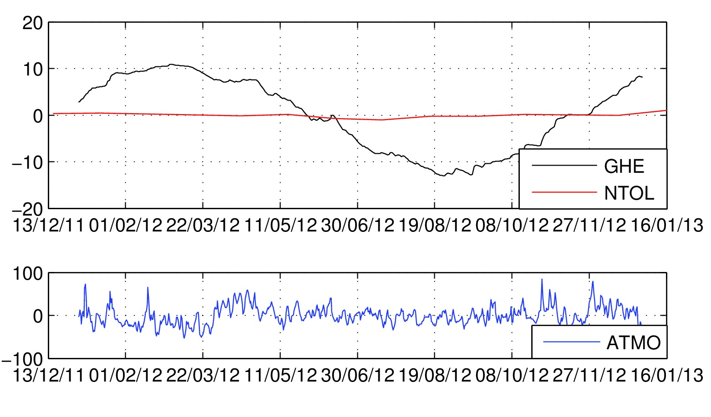

mGlobe User Manual
==================
The **_mGlobe_** toolbox allows user to **estimate the contribution of global
hydrology**, **atmosphere** and **oceans to surface gravity variations**.  
If using *mGlobe* please cite the
following paper:
> M. Mikolaj, B. Meurers, A. Güntner, **_Modelling of global mass effects in
hydrology, atmosphere and oceans on surface gravity_**, Computers &
Geosciences, Volume 93, August 2016, Pages 12-20, ISSN 0098-3004,
http://dx.doi.org/10.1016/j.cageo.2016.04.014.

#### Dependency
This toolbox is available for:
* [Matlab](https://github.com/emenems/mGlobe): MATLAB R2012a or later; Mapping and Statistics
    toolboxes
* [Octave](https://github.com/emenems/mGlobe_octave): Octave GNU 4.0 (for GUI) or later. See section 8 for details.
    * The Octave *mGlobe* GUI works only under Windows. When using *mGlobe* under Linux, i.e., via command line, see header of each function for help ( *mGlobe* has not been tested under Mac OS). Folder /EXAMPLES/ contains several scripts that show how to use *mGlobe* without GUI.
    * Many *mGlobe* functions use Octave netcdf package. Install this package before running *mGlobe* (`pkg install -forge netcdf`).
        * Additionally, install netcdf library for Linux (`apt-get install netcdf-bin` and `apt-get install libnetcdf-dev`).  
    * The results acquired using Matlab and Octave may slightly differ,
    however, the relative differences (not absolute values) should not
    exceed 0.1 nm.s-2.
    * Please keep in mind that the *mGlobe*
    GUI and functions have been primarily developed for Matlab. Therefore, the buttons response (function calls) may take some time.

## Structure
This section describes the file/folder structure required for the full
functionality of *mGlobe*.

#### Functions

The toolbox consists of following functions:

* `mGlobe.m`: **main function generating graphical user
    interface**. Run this function to start the *mGlobe* toolbox
-   `mGlobe_calc_Atmo_ERA.m`: function for the computation of the
    global and local atmospheric effects using ERA Interim atmospheric
    model
-   `mGlobe_calc_Atmo_MERRA.m`: function for the computation of the
    global and local atmospheric effects using MERRA atmospheric model
-   `mGlobe_calc_atmo_loading.m`: function used by the
    `mGlobe_calc_Atmo_ERA/MERRA.m` function for the computation of the
    atmospheric loading effect
-   `mGlobe_calc_atmo_newton.m`: function used by
    `mGlobe_calc_Atmo_ERA/MERRA.m` for the computation of the
    gravitational effect of the atmosphere
-   `mGlobe_calc_Hydro.m`: function for the computation of the global
    hydrological effect (continental water storage effect)
-   `mGlobe_calc_Ocean.m`: function for the computation of the
    non-tidal ocean loading effect
-   `mGlobe_convert_DEM.m`: function for the conversion of various
    digital elevation models to the *mGlobe* supported format, i.e. the
    Matlab structure array
-   `mGlobe_convert_ECCO.m`: function for the conversion of ECCO-JPL
    (kf080) and ECCO2 to the *mGlobe* supported file format (Matlab
    structure array)
-   `mGlobe_convert_ERA.m`: function for the conversion of the ERA
    Interim surface level model to the *mGlobe* supported file format
    (Matlab structure array)
-   `mGlobe_convert_GRACE_tellus.m`: function for the conversion of
    GRACE TELLUS land and ocean mass grid models to the *mGlobe*
    supported file format (Matlab structure array)
-   `mGlobe_convert_OMCT.m`: function for the conversion of
    OMCT/AOD1B spherical harmonics to the *mGlobe* supported file format
    (Matlab structure array)
-   `mGlobe_convert_NCEP.m`: function for the conversion of the NCEP
    Ranalysis-1 and Ranalysis-2 surface (flux) level model to the
    *mGlobe* supported file format (Matlab structure array)
-   `mGlobe_convert_OTHER.m`: function for the conversion of Other
    models to the *mGlobe* supported file format (Matlab structure
    array)
-   `mGlobe_convert_GLDAS.m`: converts the GLDAS and MERRA models to
    supported file format
-   `mGlobe_elip2sphere.m`: function for the transformation of
    ellipsoidal coordinates to spherical coordinates
-   `mGlobe_elip2xyz.m`: function for the transformation of
    ellipsoidal (longitude, latitude) coordinates to X,Y,Z
-   `mGlobe_Global.m`: function for the computation of the loading
    and gravitational effects of hydrological masses used by the
    `mGlobe_calc_Hydro.m` and `mGlobe_calc_Ocean.m` functions
-   `mGlobe_interpolation.m`: function used for the data
    interpolation and for the identification of continental and ocean
    grid cells
-   `mGlobe_Local.m`: function for the computation of the loading and
    gravitational effects of hydrological masses used by the
    `mGlobe_calc_Hydro.m` and `mGlobe_calc_Ocean.m` functions
-   `mGlobe_readAOD1B.m`: function for the reading of AOD1B products
    (see `mGlobe_convert_OMCT.m`)
-   `mGlobe_tesseroid.m`: function used for the computation of the
    gravitational effect of a tesseroid
-   `mGlobe_view1D.m`: function used for the visualization of time
    series
-   `mGlobe_view2D.m`: function used for the visualization of grids
    (longitude, latitude, z)
-   `mGlobe_mGlobe_correctionFactor.m`: function serves for the
    estimation of the site- and model-dependent correction factors.  
    * This is a supplementary function that is not required to run *mGlobe* GUI

#### Data files
In addition to above listed functionsthe following data files are required:
-   `mGlobe_DATA_dgE_Atmo.txt`: file contains the gravity response to
    the atmospheric loading as a function of the spherical distance.
    Edit this file to use other Earth’s model
-   `mGlobe_DATA_dgE_Hydro.txt`: file contains the gravity response
    to the hydrological loading as a function of the spherical distance.
    Edit this file to use other Earth’s model or to divide the loading
    contribution to part related to density re-distribution and to
    change of the position
-   `mGlobe_DATA_Load_degree_k.txt`: file contains the
    degree-dependent k load Love numbers (used for the conversion of
    OMCT/AOD1B spherical harmonics to grid)
-   `mGlobe_DATA_OceanGrid.mat`: file contains a grid used for the
    identification of continental and ocean grid cells.
    * Modify this file if high-resolution coastlines are required (default resolution 0.1 deg). This file (Matlab array) must contain following layers: oceans.lon for longitude vector (degrees), oceans.lat for latitude vector (degrees) and oceans.id with (mesh)grid of zeros (for continents) and ones (for oceans, seas and distinguishable/large lakes)
-   `mGlobe_PATH_Settings.txt`: folder settings used to load/store
    global hydrological, oceanic and GRACE models. See following **Folders**
    sub-section for details.

#### Folders
All above mentioned functions and files must be located in the same folder (/mGlobe/). The required folder structure is related to the sorting of supported global hydrological/land surface models (GHM), ocean bottom pressure models (OBPM) and GRACE mass grids. All hydrological and ocean models must not be stored in the the main *mGlobe* folder (it was mandatory in previous version). Use the `mGlobe_PATH_Settings.txt` file to set path for GHM, OBPM and GRACE separately. These folders must then contain following sub-folders:
* mGlobe/GHM/
    * CLM | ERA | MERRA | MERRA2 | MOS | NCEP | NOAH025 | NOAH025v21 | NOAH10 | OTHER | VIC |
	* GRACE
		* LAND
		* OCEAN
* mGlobe/OBPM/
	* ECCO1 | ECCO2 | OMCT | OMCT6 | OTHER

All test results, inputs and examples how to run *mGlobe* without GUI are stored in the /EXAMPLES/ folder (optional). Digital elevation models and atmospheric models (ERA and MERRA) can be stored in arbitrary folders.

## Models
The computation of the gravity response to large scale effects requires the conversion of input models to the supported file format. The list below shows all supported models (as of 26th of May 2017). The first part of the table shows hydrological models, the second part ocean models (ocean bottom pressure models) and the last part shows the supported atmospheric models. The time resolution shows the maximal possible time resolution. All GLDAS, MERRA and ERA Interim models are also available in monthly resolution.

#### Hydrological models
* GLDAS/CLM [3-hourly](https://disc.gsfc.nasa.gov/SSW/#keywords=GLDAS_CLM10SUBP_3H) and [monthly](https://disc.gsfc.nasa.gov/SSW/#keywords=GLDAS_CLM10_M)
    * Storage layers: *Average_layer_soil_moisture* and *Snow_Water_Equivalent*
* GLDAS/MOS [3-hourly](https://disc.gsfc.nasa.gov/SSW/#keywords=GLDAS_MOS10SUBP_3H) and [monthly](https://disc.gsfc.nasa.gov/SSW/#keywords=GLDAS_MOS10_M)
    * Storage layers: *Average_layer_soil_moisture* and *Snow_Water_Equivalent*
* GLDAS/NOAH025 [3-hourly](https://disc.gsfc.nasa.gov/SSW/#keywords=GLDAS_NOAH025SUBP_3H) and [monthly](https://disc.gsfc.nasa.gov/SSW/#keywords=GLDAS_NOAH025_M)
    * Storage layers: *Average_layer_soil_moisture* and *Snow_Water_Equivalent*
    * Model is offline since end of 2016
* GLDASv2.1/NOAH025 [3-hourly](https://hydro1.gesdisc.eosdis.nasa.gov/data/GLDAS/GLDAS_NOAH025_3H.2.1) and [monthly](https://hydro1.gesdisc.eosdis.nasa.gov/data/GLDAS/GLDAS_NOAH025_M.2.1)
    * Storage layers: *Average_layer_soil_moisture* and *Snow_Water_Equivalent*
* GLDAS/NOAH10 [3-hourly](https://disc.gsfc.nasa.gov/SSW/#keywords=GLDAS_NOAH10SUBP_3H) and [monthly]((https://disc.gsfc.nasa.gov/SSW/#keywords=GLDAS_NOAH10_M)
    * Storage layers: *Average_layer_soil_moisture* and *Snow_Water_Equivalent*
* GLDAS/VIC [3-hourly](https://disc.gsfc.nasa.gov/SSW/#keywords=GLDAS_VIC10_3H) and [monthly](https://disc.gsfc.nasa.gov/SSW/#keywords=GLDAS_VIC10_M)
    * Storage layers: *Average_layer_soil_moisture* and *Snow_Water_Equivalent*
* MERRA/Land [hourly](https://disc.gsfc.nasa.gov/SSW/#keywords=MAT1NXLND) and [monthly](https://disc.gsfc.nasa.gov/SSW/#keywords=MATMNXLND)
    * Storage layers:  *Total water store in land reservoirs*
    * Model is offline since end of February 2016
* MERRA2/Land [hourly](https://disc.gsfc.nasa.gov/SSW/#keywords=M2T1NXLND) and [monthly](https://disc.gsfc.nasa.gov/SSW/#keywords=M2TMNXLND)
    * Storage layers: *Avail_water_storage_land*
* NCEP Reanalysis-1 [6-hourly](https://www.esrl.noaa.gov/psd/data/gridded/data.ncep.reanalysis.surfaceflux.html)
    * Storage layers: *Soil moisture* and *Water equiv. of snow depth*
* NCEP Reanalysis-2 [6-hourly and monthly](https://www.esrl.noaa.gov/psd/data/gridded/data.ncep.reanalysis.surfaceflux.html)
    * Storage layers: *Soil moisture* and *Water equiv. of snow depth*
    * Model is offline since end of 2016
* ERA Interim [6-hourly and monthly](http://apps.ecmwf.int/datasets/data/interim-full-daily/)
    * Storage layers: *Volumetric soil water layer* and *Snow depth*
* Other models can be converted to *mGlobe* format using provided function `mGlobe_convert_OTHER.m` and GUI (Panel: Models)

#### Ocean bottom pressure models (OBPM)
* ECCO-JPL
    * 12-hourly: ftp://snowwhite.jpl.nasa.gov/NearRealTime/KalmanFilter and
    * Monthly ftp://podaac-ftp.jpl.nasa.gov/allData/tellus/L3/ecco_obp/
    * Product: *OBPano* (ocean bottom pressure anomaly)
* ECCO2 daily: ftp://ecco2.jpl.nasa.gov/data1/cube/cube92/lat_lon/quart_90S_90N/PHIBOT.nc/
    * Product: *Bottom Pressure Pot. Anomaly*
* OMCT RL05 6-hourly: ftp://isdcftp.gfz-potsdam.de/grace/Level-1B/GFZ/AOD/RL05
    * Products: *atm* (atmospheric part), *ocn* (oceanic part), *oba* (ocean bottom anomaly)
* OMCT RL06 3-hourly: ftp://isdcftp.gfz-potsdam.de/grace/Level-1B/GFZ/AOD/RL06/
    * Products: *atm* (atmospheric part), *ocn* (oceanic part), *oba* (ocean bottom anomaly)
    * The conversion of RL06 is very slow, especially when using Octave (10x slower than in Maltab. Needs to be optimized)!

#### Atmospheric models
* ERA Interim 6 hourly model values
    * Products: [surface](http://apps.ecmwf.int/datasets/data/interim-full-daily/levtype=sfc/) and [pressure](http://apps.ecmwf.int/datasets/data/interim-full-daily/?levtype=pl/) level data
* MERRA(1) is offline and not supported any more (MERRA2 model coming "soon")

#### GRACE
* GRACE [land](https://grace.jpl.nasa.gov/data/get-data/monthly-mass-grids-land/) and [ocean](https://grace.jpl.nasa.gov/data/get-data/monthly-mass-grids-ocean/)
  * Products: mass grids (neither spherical harmonics, nor masscons)

### Convert hydrological models
*mGlobe* requires hydrological and oceanic data to be stored in prescribed format. This section briefly describes few examples how to convert the above listed models to *mGlobe* supported format.

#### Example: Convert GLDAS and MERRA models
To download the data, create an account following the [Earthdata login](https://wiki.earthdata.nasa.gov/display/EL/How+To+Register+With+Earthdata+Login) instructions, i.e. [register](https://urs.earthdata.nasa.gov) and authorize the Authorize NASA GESDISC data archive. After these steps, request/download model data using the list of URLs in the section above.  
* Before pressing ’Search for Data Sets’, specify the ’Data Range’ and
leave the ’Spatial Bounding Box’ empty  
* For **GLDAS** models select following ’Subset Variables’:
    * *Average layer soil moisture* and *Snow Water Equivalent*
* For **MERRA** model, select:
    * *Total water store in land
reservoirs* or *Avail\_water\_storage\_land* for **MERRA2**  
* Make sure no other subset is selected
* For all models, change the output file format to
**NetCDF** and press ’Subset Selected Data Sets’  
* Download the prepared files after pressing ’View Subset Results’.
    * For [convenient downloading](http://disc.sci.gsfc.nasa.gov/ssw/documentation/SSW_URL_List_Downloading_Instructions.html)
use DownThemAll! Mozilla extension or wget (unix only)
Do not rename the downloaded files.
* To convert the downloaded netcdf
files to mat format, use the **Models** console.
    * User will be prompted to select one NetCDF file after pressing ’Convert’ button (all other
requested file names will be generated automatically).  
    * To convert the data without using GUI or to modify the input file (URLs) for DowThemAll! (remove redundant files), use the `EXAMPLES/Scripts/convert_gldas_merra_models.m` script (in Unix, use ’Convert’ for URL list reduction)

#### Example: convert ERA Interim model
This example shows how to convert the downloaded ERA Interim (surface level, not the pressure level) model to the supported file format.  
* First go to [ERA Server](http://apps.ecmwf.int/datasets/data/interim-full-daily/?levtype=sfc) and register/login if required.
* Than select the 2012 year (all months)
* Select the time: 00,06,12,18 (6 hour resolution). Select the step 0, i.e. the analysis.
* Than select the following parameters:
    * *Snow depth*,
*Volumetric soil water layer 1-4* and press Retrieve **NetCDF**.
* If necessary
change the attributes Grid to 0.75x0.75 and Area: Default (as archived =
global coverage).
* Press Retrieve now. The downloading may take several
hours depending on the internet connection (file size around 1 GB)
    * Check the [ERA instructions](https://software.ecmwf.int/wiki/display/WEBAPI/Access+ECMWF+Public+Datasets) for more convenient downloading
* After you have downloaded the ERA Interim NetCDF file, run *mGlobe* and select the **Models** panel.
* Change the date to *Start* = 2012 01 01 00
and *End* = 2012 12 31 18 (hours must be equal to 0/6/12/18)
* Then switch the *Step* to ’6 Hours’
* Select the downloaded ERA Interim NetCDF file using the *Input* button in the ERA/NCEP convert (netCDF)
sub-panel
* Press *Convert ERA* to convert the model.
    * The conversion should not take more than few minutes.
    * The converted model is now stored in the /GHM/ERA/ folder. You may delete the original NetCDF file now.

#### Example: convert DEM
This example shows how to convert a digital elevation model (DEM) downloaded via the GEODAS Grid Translator to the supported file format.
> This is just an example. The use of ETOPO DEM is not suitable for areas close to seas because *mGlobe* requires zero DEM values over the seas and oceans!
> Only DEMs in geographic coordinate system can be transformed
using this function.

The computation of the continental water storage effect allows the inclusion of a digital elevation model (optional). This DEM must cover an area up to a spherical distance of 1 deg (approx 110 km) from the point of observation. This model must be stored in the supported format (Matlab structure array). The DEM conversion sub-panel is used for the conversion of various DEM file formats.

* First, go to [NOAA](https://maps.ngdc.noaa.gov/viewers/wcs-client/) data server and select ETOPO1 global relief
* Set the latitude to 46N - 50N degrees and the longitude to 14E - 19E
* Choose the XYZ (lon,lat,depth) Raster Format + download
* After you have downloaded the DEM, run *mGlobe* and select the
**Models** panel
* To convert your DEM, use the *Input* button and select
’txt (Lon,Lat,Height)’ file format from the DEM conversion sub-panel.
* Select the output file (\*.mat) and press the *Convert DEM* button
    * You may delete the original DEM file now.

#### Example: convert other models
This example shows how to convert other models that are currently not supported/freely available, e.g. WGHM, GRACE ICGEM water column, etc..  
> These models must have a global coverage (in longitude, -180:180 deg) and a constant spatial sampling. This tool can be use either for global hydrological models or ocean bottom pressure models.

*mGlobe* supports the loading from txt files where the first two columns are reserved for the longitude/latitude and the third column is reserved for model values (water column). To load such files, each file name must have a prescribed structure:
* First ten characters are used for the model
name followed by underscore and model year (YYYY), month (MM), day (DD), underscore and model hour (HH). Example:
    * `MODEL_NAME_20120128_12.txt`
(see folder /EXAMPLES/Models/ for such file).
* Run *mGlobe* and select the **Models** panel
* Select one of your input files using the *Input* button (all files must be stored in the same folder).
* Select a file *Type* that corresponds to the input file
(e.g. ’Lon,Lat, Water(m)’ , where the longitude should be in a -180:180 and not in 0:360 degree system).
* Change the *Header* lines accordingly
* Set the *Start*, *End* and *Step* to required values and press
*Convert model*.
    * The converted model is now stored in the /GHM/OTHER/
folder.
    * If you have transformed an ocean bottom pressure model, copy the created files to the /OBPM/OTHER/ folder.
> The conversion function creates automatically \*.mat files containing `out_mat` array including following layers: `lon` (for longitude in degrees), `lat` (latitude in degrees),`total` (total water storage in mm), `input_file` (input file name without path), `units` (output units, i.e. mm) and `time` (Matlab time, i.e. computed using datenum function). The `lon` and `lat` layers are created using Matlab meshgrid function.

#### Example: convert GRACE Tellus Land grid
This example shows how to convert GRACE land mass grid to Matlab
structure array.
* First go to Tellus server: ftp://podaac-ftp.jpl.nasa.gov/allData/tellus/L3/land_mass/RL05/netcdf/
and download the grid data file.
    * Example: `GRCTellus.GFZ.200204_201403.LND.RL05.DSTvSCS1401.nc` and
* the scaling matrix file, e.g. `CLM4.SCALE_FACTOR.DS.G300KM.RL05.DSTvSCS1401.nc`.
    * This file is used to restore the energy lost due to the filtering
(especially at the seasonal time scale).
* Run *mGlobe* and select the **Models** panel
* Press the *Input* button from the GRACE sub-panel to select the downloaded mass grid file (e.g `GRCTellus.GFZ.200204_201403.LND.RL05.DSTvSCS1401.nc`)
* Change the prefix to required string, e.g. `GRC_GFZ_RL05_LND_vSCS1`.
    * This name must be exactly 22 characters long.
* Change the pop-up menu to ’Land Grid’
* Check the *Scale* option.
    * The downloaded scale matrix is designed for
land grids not ocean grids
* Change the *Start* and *End* time period as desired
* The *Step* option is not use in this case
* Press *Convert GRACE* to start the conversion.
    * You will be prompted to select the downloaded scaling matrix file as well as the scaling matrix NetCDF layer (mostly denoted as `SCALE_FACTOR`).
    * The converted model is now stored in the /GRACE/LAND/ folder. You can delete the input file now.

> During the computation of GRACE global hydrological or non-tidal ocean loading effect, *mGlobe* changes the current folder to /GRACE/LAND/ or /GRACE/OCEAN/ and searches for all files with given name/prefix and within the given time period.   
> This is in contrast to the use of hydrological or oceanic models where the algorithm selects only those files that matches current time epoch. This is related to the irregular GRACE time sampling.

#### Example: convert NCEP Reanalysis 1 & 2 model
This example shows how to download and convert NCEP Reanalysis 2
(NCEP-DOE Reanalysis 2: Gaussian Grid) model to the supported file format. These instructions can be also used to convert NCEP Reanalysis 1 data (monthly data for Reanalysis 1 is not supported).
* First go to [NCEP dataset](
<http://www.esrl.noaa.gov/psd/data/gridded/data.ncep.reanalysis2.gaussian.html) (see Table 1 for Reanalysis 1)
* Download all *soil moisture layer*s, i.e. *0–10* and *10–200 cm*, and *water equiv. of snow depth*
    * Select 4-times Daily Values or monthly
    * These data sets are stored in individual files for each layer and year, i.e., `soilw.0-10cm.gauss.2012.nc` for soil moisture 0–10 cm, `soilw.10-200cm.gauss.2012.nc` for 10–200 cm, and `weasd.sfc.gauss.2012.nc` for snow.
* Download these files into one folder. Do not rename these files.
* After you have downloaded the NCEP NetCDF files, run *mGlobe* and select the **Models** panel.
* Change the date to *Start* = 2012 01 01 00 and
*End* = 2012 12 31 18 (hours must be equal to 0/6/12/18).
* Switch the *Step* to ’Day’.
* Select one downloaded NCEP NetCDF file using the *Input* button in the ERA/NCEP convert (netCDF) sub-panel.
* Press *Convert NCEP* and select *Reanalysis-2* version to convert the model.
    * The conversion should not take more than few minutes
    * The converted model is now stored in the /GHM/NCEP/ folder. You may delete the original NetCDF file now.

## Hydro
This console is designed for the computation of the global hydrological effect (GHE), i.e. the contribution of continental water storage to surface gravity variations. User may choose from several supported models as well as other models converted via provided functions. See section **Model** (above) for the model downloading/conversion.
> All results should be understood as relative results and not the gravity effect of the whole hydrosphere.

-   Position: set the *Latitude*, *Longitude* and *Height* of your station.
    * Ellipsoidal latitude: WGS84, -90:90 deg.
    * Ellipsoidal longitude: WGS84, -180:180 deg.
    * (Ellipsoidal) height: this height is used for the zone up to 1 deg from the given position. Set this value to zero if you do not want to use a DEM.
-   Time: set the time coverage.
    * *Hour* must be equal to 0,3,6...18.
    * *Step* determines the time resolution (max. time resolution/step = 3 hours, min. time resolution/step = month).
-   Hydrological model: select your *Model*, i.e. GLDAS/MERRA/ERA
    Interim/NCEP/Other/GRACE.
    * Hydrological layer: select your *Layer*, i.e. total (sum of all layers) or individual layer, e.g. soilm1.
    * The model *Path* and name are fixed. Model values for each time epoch are stored in individual files (structure array: \*.mat format) and must have a prescribed name (generated by during model conversion)
    * *Exclude*: exclude Greenland or Antarctica, i.e. the areas where hydrological models do not provide reliable information.
        * For these areas, the water amount is set to zero. This option is automatically turned off if the *Mass conservation* is set to ’Continent + Ocean model’
    * *Include only*: optional loading of an inclusion polygon to set all values outside the given area to zero.
        * The *mGlobe* supports the loading of a \*.txt file without header lines, or header starting with % sign. First column is reserved for the longitude (degrees,     -180:180) and the second column for the latitude (degrees, -90:90).
        * An example of such a file is stored in     /EXAMPLES/Hyro/`TEST_InclusionPolygon.txt`. The Matlab inpolygon function is used to identify grid cells (from GHM grid in original resolution) inside the polygon.
        * The total mass used in *Mass conservation* principle enforcement does not take the inclusion polygon into consideration.
    * *Mass conservation*: hydrological models tend to increase the amount of water in the system with respect to time. To minimize this artificial as well as natural (continent-ocean exchange) effect, choose ’Ocean layer (from mass excess)’.      
        * In such case, an uniform water layer over the ocean with variable thickness in time is created. For GLDAS, MERRA, NCEP and ERA Interim models, a long term (2000-2010) average is used (same average regardless of selected *Layer*.
        * Thereby, the exclusion of Greenland/Antarctica is considered (not the inclusion polygon).
        * The uniform water layer is then computed as a difference between the current epoch and the average value.
        * For Other/GRACE models, the first time epoch is used as a reference value. The gravity response to global ocean level rise of one mm can by found  in the output file.
        * To substitute the ocean level variations driven by hydrological model by observed global mean sea level (GMSL) variations, subtract the computed ocean loading and Newtonian part and replace it using GMSL variations (corrected for steric effect)  multiplied by the given gravity response.
        * If you are using a coupled model (Other) with water grid on oceans and continents, choose ’Continent + Ocean model’. This will compute also the contribution of Ocean as given by model values.
        * The ’off’ option will result in a gravity response to water storage variations as given by the model with no mass variation over the Ocean.
        > The provided file `mGlobe_DATA_OceanGrid.mat` is used to identify Oceans/Continents.  
        > The enforced *Mass conservation* principle should be chosen in accordance with the Ocean bottom pressure model used for the non-tidal ocean loading effect.

-   Topography: (Optional) Load a digital elevation model (DEM) for points up to 1 deg (spherical distance) from the given position.
    * The loading of a DEM with an insufficient spatial
    extension will result in NaN values.
    * The *mGlobe* supports \*.mat files, where the DEM is stored as a structure array: dem.lon (meshgrid longitude in degrees, -180:180), dem.lat (meshgrid latitude in degrees, -90:90) and dem.height (height in meters).
    * See the instructions above (in **Models** section) for the conversion from other file formats.
    * If the DEM is not loaded, the effect will be calculated for a spherical approximation.
    > The height for points on the ocean must be equal to
    zero!
    > To undo the selected DEM, simply press cancel when choosing
    the DEM file (same procedure for inclusion polygon).

    * *Show*: plot DEM and the point of the computation.

-   Output: select your output *File* (pick file = full file name + extension). The file extension will be changed automatically, but the selected output file must have three characters long file extension (e.g. `OutputFile.txt`).
    * Results will be saved to the selected file formats (*txt, xls, tsf*). Please note that the *xls* output works only with installed Microsoft Office Excel.
        * *mGlobe* will create a new file or will write in an existing xls file! It is recommended to delete the     existing xls file before writing. The [TSoft](http://seismologie.oma.be/TSOFT/tsoft.html) (*tsf*) format is not supported for monthly step.\
    * The *subtract average* option will subtract the mean value from all results.
        * Do not use this option if you split the computation into
    several periods/files as the mean value changes in time.
-   *Threshold (deg)*: set the threshold between the local and the global zone expressed in the spherical distance (degrees, min. = 0.05, max = 1.00 deg). This value is than applied to the  re-interpolated mass grid and not the grid in the original  resolution.
* *SHP (optional)*: select land shapefile (SHP) for high(er)-resolution land/ocean identification. SHP files as provided by [Natural Earth](http://www.naturalearthdata.com/downloads/) are supported.
    * Shapefile will be applied only to local grid cells, i.e. up to max. 1.1 degrees from point of computation. Remaining cells (or all cells if SHP not selected) will be identified using `mGlobe_DATA_OceanGrid.mat` grid. This file can by created using the  `EXAMPLES\Scripts\create_ocean_grid.m` script.
    * It is ineffective to load files with resolution higher than 1:50 m (due to the resolution of the computation grid)

#### Example: Compute the GHE (GLDAS/NOAH10)
This example shows how to compute a global hydrological effect for Vienna (2012) using the GLDAS/NOAH10 model (assuming the GLDAS/NOAH10 model has been downloaded).

* Run *mGlobe* and select the **Hydro** console.
* Set the *Latitude* to 48.24885, the *Longitude* to 16.35650 and the *Height* to 192.70 m
* Set the *Start* time to 2012 01 01 12, the *End* time to 2012 12 31 12
* Set *Step* to Day.
* Then change the hydrological model to GLDAS/NOAH (1 deg)
* Set *Layer* to total
* Select the *Exclude: Greenland*, and
* Switch the *Mass conservation* to ’Ocean layer (from mass excess)’.
* Load the DEM using the *DEM to 1 deg* button (see section 2.3 for
the conversion of DEM).
    * If you want to compute a pure spherical approximation, do not load the DEM and set the *Height* to 0 m.
    * Press *Show* to plot the position and the DEM.
* Choose your output file using the *File* button from the Output sub-panel (e.g.
`TEST_GHE_NOAH10_012012_122012.txt`).
* Select the *subtract average* option to subtract the mean value.
* Change the *Threshold (deg):* to 0.1
* Then press *Calculate*.
    * The computation may take few minutes.

#### Hydro Outputs
The computed gravity effects can be written to a text, Excel or [TSoft](http://seismologie.oma.be/TSOFT/tsoft.html) file. Besides information about position and used *mGlobe* settings, these files contain following columns/abbreviations:
-   `time_matlab`: time in Matlab format, i.e., days since 0/0/0 00:00
    (UTC)
-   `Date`: calendar date, i.e., YYYYMMDD
-   `Time`: time, i.e., HHMMSS (UTC)
-   `total_eff`: total gravity effect (nm.s-2)
-   `cont_load`: effect related to loading over continents
    (nm.s-2)
-   `cont_newton`: gravitational effects related to masses over
    continents (nm.s-2)
-   `ocean_load`: effect related to loading over oceans
    (nm.s-2)
-   `cont_newton`: gravitational effects related to masses over oceans
    (nm.s-2)
-   `local_TWS(mm)`: interpolated water storage in mm (see *Layer*
    setting)

## Ocean
User may choose from default models as well as other models converted via provided functions. The ECCO models are converted from this console whereas the GRACE and Other models are converted from the **Models** console. It is recommended to use models that include the ocean response to atmospheric pressure variation. All results should be understood as relative results and not the gravity effect of the whole hydrosphere. The `mGlobe_DATA_OceanGrid.mat` file is used to identify Ocean and Continent grid cells.

-   Position: same as for **Hydro**
-   Time: same as for **Hydro**
-   Model setup and conversion: select your *Model version*, i.e.
    ECCO1/Other/GRACE/ECCO2.
    * The model *Path* is fixed. Each time epoch is stored in an
    individual file (structure array: \*.mat format) and must have
    prescribed name.
    * Use the *Convert (ECCO/OMCT)* button for the conversion of ECCO and
    OMCT models. The conversion of ECCO1 (JPL) 12 hours model requires the same folder structure as the distribution: ftp://snowwhite.jpl.nasa.gov/data4/KalmanFilter
        * Conversion of monthly ECCO1 model requires that all input files (unpacked) are store in the same folder. Same holds true for ECCO2 NetCDF files. All OMCT/AOD1B data files must be stored in one folder.

    * The *Subtract area average* option serves for the subtraction of global weighted (area) mean that varies in time.
        * The aim of this correction is to enforce a constant mass in time.
        > Please keep in mind that the global area mean may have been already subtracted during the pre-processing. This is the case for monthly ECCO-JPL solutions (not for 12 hours).
        > This option relates to the computation of NTOL, not to the conversion of models.

        * The selection of ’Use mean pressure time series’ will make visible additional options, i.e., selection of time series stored in an txt file. The loaded file must  contain time in Matlab format (datenum function) and pressure variations in Pa (standard *mGlobe* txt output).

-   Output: same as for **Hydro**
-   *Threshold (deg)*: same as for **Hydro**

#### Example: convert the ECCO-JPL model
This example shows how to convert ECCO-JPL (ECCO1 monthly) data to *mGlobe* supported file format.
* First download the ECCO1 model: ftp://podaac-ftp.jpl.nasa.gov/allData/tellus/L3/ecco_obp/ **monthly** data for the time period between December 2011 (`ECCO_kf080_2011335_2011365_AveRmvd_OBP.txt.gz`) and January 2013 (`ECCO_kf080_2013001_2013030_AveRmvd_OBP.txt.gz`).
    * Unpack these files to one folder.
* After you have downloaded and unpacked the ECCO-JPL data, run *mGlobe* and select the **Ocean** console.
* Set the *Start* time to 2011 12 01 12, the *End* time to 2013 01 31 12
* Set the *Step* to ’Month’.
* Then change the ocean model to ’ECCO-JPL (conversion: \*.txt / calculate \*.mat)’.
* Select one file from the folder with the downloaded and unpacked
ECCO-JPL model using the *Input* button.
* Then press the *Convert (ECCO only*) button.
    * The conversion should not take more then few minutes. The
result is stored in the /OBPM/ECCO1/ folder.

* If you want to convert the **12 hour** version of the ECCO-JPL model, store the downloaded NetCDF files in the same folder structure as distributed via the JPL ftp server: ftp://snowwhite.jpl.nasa.gov/data4/KalmanFilter
    * : `KalmanFilter/kf080_YYYY/n10days_XX_YY/`
    * Due to the latency of the model, you may need to rename the folder and the name of the last file to its full year equivalent, e.g. from `KalmanFilter/kf080_2014/n10day_28_33/OBPano_08_08.06480_07920_012.cdf` to `KalmanFilter/kf080_2014/n10day_28_37/OBPano_08_08.06480_08880_012.cdf`.

#### Example: convert the OMCT RL05 (oba) model
This function allows the conversion of AOD1B products, i.e. OMCT model, to grids. User can select the ’OMCT oba’ (total ocean bottom pressure anomalies), ’OMCT ocn’ (contribution of the ocean water column) or ’OMCT atm’ (contribution of the atmosphere (ECMWF)) layer.
* The spherical harmonics will be converted to grid with spatial resolution of 1 degree
> Keep in mind that the real resolution is lower as the maximal degree of the AOD1B RL05 products equals 100 (all degree coefficients are utilized, i.e. including 0 and 1).

The conversion is based on the paper by [Wahr et al., (1998)](http://onlinelibrary.wiley.com/doi/10.1029/JB090iB11p09363/abstract;jsessionid=AE6134DBC552053212C1A8A8994FB93B.f03t02): *Time variability of the Earth’s gravity field: Hydrological and oceani effects and their possible detection using GRACE*. Journal of Geophysical Research, vol. 103, no. B12.   
> The `mGlobe_DATA_OceanGrid.mat` grid is used to set all grid cells over the continents to NaN.   
> This affects the difference between the gravity effect computed via *mGlobe* (based on
Green’s functions) and using directly AOD1B coefficients (synthesis of
spherical harmonic coefficients).

* First download: ftp://podaac-ftp.jpl.nasa.gov/allData/grace/L1B/GFZ/AOD1B/RL05  2013 AOD1B (Release 05) data files.
    * Prior to the conversion, unpack all files.
* Then go to the **Ocean** console and set the *Start* time to 2013 01 01 12, the *End* time to 2013 12 31 12
* Set *Step* to ’6 hours’ (monthly resolution is not supported). * Select one of the downloaded and unpacked files using the *Input* button, e.g. `AOD1B_2013-01-01_X_05.asc`.
* Then switch the *Model version* to ’OMCT oba’ and press the *Convert (ECCO/OMCT)* button.
    * The conversion requires several hours. The result is stored in the /OBPM/OMCT/ folder.

#### Example: compute the NTOL effect (ECCO-JPL)
This example shows how to compute the non-tidal ocean loading effect for Vienna (2012) using ECCO-JPL monthly model (assuming the ECCO-JPL model has been downloaded and converted).

* Run *mGlobe* and select the **Ocean** console.
* Set the *Latitude* to 48.24885, the *Longitude* to 16.35650 and the *Height* to 192.70 m
* Set the *Start* time to 2011 12 01 12, the *End* time to 2013 01 31 12 and the *Step* to ’Month’.
* Then change the ocean model to ’ECCO-JPL’.
* Choose your output file using the *File* button from the Output sub-panel (e.g. `TEST_NTOL_ECCO-JPL_012012_122012.txt`). * Set the *Subtract mean field* option to ’off’.
* Change the *Threshold (deg):* to 0.1 and then press
*Calculate*.
    * The computation may take several seconds.

#### NTOL Outputs
The computed gravity effects can be written to a text, Excel or [TSoft](http://seismologie.oma.be/TSOFT/tsoft.html) file. Besides information about position and used *mGlobe* settings,
these files contain following columns/abbreviations:
-   `time_matlab`: time in Matlab format, i.e., days since 0/0/0 00:00 (UTC)
-   `Date`: calendar date, i.e., YYYYMMDD
-   `Time`: time, i.e., HHMMSS (UTC)
-   `total_eff`: total gravity effect (nm.s-2)
-   `cont_load`: effect related to loading over continents (zero for NTOL)
-   `cont_newton`: gravitational effects related to masses over  continents (zero for NTOL)
-   `ocean_load`: effect related to loading over oceans
    (nm.s-2)
-   `cont_newton`: gravitational effects related to masses over oceans
    (nm.s-2)
-   `subtracted_press(Pa)`: pressure subtracted from each grid cell (see
    *Subtract mean field* options)

## Atmo
This console is designed for the computation of the global+local atmospheric effect. The atmosphere is modelled by pressure levels (levels of constant pressure). The density variation is calculated from temperature, specific humidity and pressure given by the ECMWF ERA Interim (37 levels) or MERRA (42 levels) models. Additional introduction of a correction/admittance factor (e.g. -3 nm.s-2/hPa) is required due to the deficient spatial and temporal resolution of atmospheric models! This factor should be applied to the difference between the in-situ and model pressure variation and added to the computed local effect.   
No loading effect over the ocean is computed. Therefore, the ocean response to atmospheric pressure variation should be considered within the computation of the Non-tidal ocean loading effect (panel **Ocean**).

### ERA Interim
ECMWF (ERA Interim Analysis) data: No conversion is required. The *mGlobe* uses data stored in NetCDF format as retrieved from ECMWF servers.
-   Position: same as for **Hydro**. The input height will not be
    considered. The computation uses orography heights.
-   Time: set the time coverage.
    * *Hour* must be equal to 0,6,12,18
    * *Step* determines the time resolution (max. time resolution/step = 6 hours, min. time resolution/step = 2 days).
* *Geopotential*: netCDF file containing: ’longitude’,’latitude’,’time’,’levelist’,’z’ layers.
    > The height in m is obtained after dividing by 9.80665 m.s-2  
    > These layers must have the same dimensions (latitude, longitude) as Orography

    One file contains one (or part of) year sampled every     24 hours, e.g. year = 2011, hour = 06. Fix file name must be used, i.e. last 7 characters (without file extension \*.nc) = `arbitrary_HH_YYYY.nc`, e.g. `ERA_Interim_Geopotential_06_2011.nc`.  
    File downloaded via [ERA dataset](http://apps.ecmwf.int/datasets/data/interim-full-daily/?levtype=pl) using following downloading options:  
    * Type of level = pressure level
    * ERA Interim fields = daily,
    * Level = 1 to 1000,
    * Retrieve netCDF,
    * Area = default,
    * Grid = 0.75x0.75 deg.  
* *Specific humidity* = netCDF file containing:
    ’longitude’,’latitude’,’time’,’levelist’,’q’. These layers must have the same dimensions (latitude, longitude) as *Orography*.   
    The same downloading settings as for *Geopotential*.  
* *Temperature* = netCDF file containing:
    ’longitude’,’latitude’,’time’,’levelist’,’t’. These layers must have the same dimensions (latitude, longitude) as *Orography*.   
    The same downloading settings and file name structure as for *Geopotential*.  
* *Surface data* = netCDF file containing:
    ’longitude’,’latitude’,’time’,’t2m’ (2 metre temperature),’d2m’ (2 metre dew-point temperature),’sp’ (Surface pressure). These layers must have the same dimensions (latitude,longitude) as *Orography*.  
    * One file contains one full (or part of) year and ALL hours (e.g. year = 2011, hour = 00,06,12,18 i.e. 6 hour sampling)! Fix file name must be used, i.e. last 6 letters (without extension \*.nc) = `arbitrary_D_YYYY.nc`, e.g. `ERA_Interim_Surface_D_2011.nc`.\
    * File downloaded via [ERA dataset](http://apps.ecmwf.int/datasets/data/interim-full-daily/?levtype=sfc) using following downloading options:
        * ERA Interim fields = daily,
        * Type of level = surface,
        * Select time = 0,6,12,18,
        * Step = 0, i.e. analysed fields, not forecast. This option is not related to *mGlobe* *Step* setting!
        * Retrieve netCDF,
        * Area = default,
        * Grid = 0.75x0.75 deg.
* *Orography* = netCDF file containing: ’longitude’,’latitude’,’z’ layers
    > Height is obtained after dividing by 9.80665 m.s-2.
    > This is a reference grid used for the computation, i.e. this grid defines the spatial resolution. All the other ERA Interim input data must have the same resolution (longitude, latitude).
    > File name is not fixed (e.g. `ERA_Interim_Invariant.nc`).

    * File downloaded via [ERA dataset](http://apps.ecmwf.int/datasets/data/interim-full-invariant/) using following downloading options:
        * ERA Interim fields = invariant,
        * Parameter = geopotential,
        * Retrieve NetCDF,
        * Area = default,
        * Grid = 0.75x0.75 deg

    > MERRA surf.p* = for MERRA model only

#### MERRA/Atmosphere
The MERRA(1) is offline since end of February 2016. Support for MERRA2 model will be added "soon". To compute MERRA(1) atmospheric effect, check previous version/commits of *mGlobe*

#### Example: download the ERA Interim temperature
This example shows how to download and store the ERA Interim temperature data required for the computation of the atmospheric effect.

**Pressure level:** First go to [ERA dataset](http://apps.ecmwf.int/datasets/data/interim-full-daily/?levtype=pl) and Login/register. It is highly recommended to download the data using [Python script](https://software.ecmwf.int/wiki/display/WEBAPI/Access+ECMWF+Public+Datasets). Otherwise download manually:
* Select the 2012 year (all months)
* Select time 12:00:00
* Temperature parameter (all levels, i.e. 1000 to 1 hPa)
* Press Retrieve NetCDF.
    * Ensure that the Area is set to ’Default (as archived)’, i.e. global coverage and the Grid is equal 0.75x0.75.
    * Press Retrieve now.
* Save the file respecting the prescribed suffix, e.g. `ERA_GEOPOT_24hStep_12_2012.nc`, to your folder with the temperature data.

To download the **surface temperature** go to [ERA dataset](http://apps.ecmwf.int/datasets/data/interim-full-daily/?levtype=sfc).
* Select the whole year (2012)
* Select all time check-boxes (0,6,12,18)
* Step 0
* Then select following parameters:
    * 2 metre temperature,
    * 2 metre dewpoint temperature and
    * Surface pressure.
* Press Retrieve NetCDF as in the case of the pressure level data.
* Save the file respecting the prescribed suffix, e.g. `ERA_SP_2T_2D_ALLh_06hStep_D_2012.nc`, to your folder with the surface data.

#### Example: compute the Atmospheric effect
This example shows how to compute the atmospheric effect for Vienna (2012) using ERA Interim model. It is advisable to use ERA model instead of MERRA as better results were achieved using ERA and the data files are provided in more consistent way.
* Run *mGlobe* and switch to the **Atmo** console.
* Set the *Start* time to 2012 01 01 12
* Set *End* time to 2012 12 31 12
* *Step* to ’12 Hours’.
* Locate the geopotential NetCDF file by pressing *Geopotential*. Keep in mind that all geopotential files must be stored in this folder.
* Do the same for *Temperature*, *Specific humidity*, *Surface data* and
*Orography*.
* Choose your output file using the *File* from the Output
sub-panel (e.g. `TEST_ATMO_ERA_012012_122012.txt`).
* Press *Calculate ERA*.
* Subsequently, introduce the local residual effect by adding a(_factor_)\*[p(_in-situ_) p(_model_)],
    * where the a(_factor_) is the correction/admittance factor and the p stands for the pressure variation observed close to the gravimeter (in situ) and interpolated from the atmospheric model.
    * To obtain the site-specific correction factor, use the `mGlobe_mGlobe_correctionFactor.m` function. See function help for more
information.

> The computation may take several hours to days depending on the
CPU (Intel Core i7@3.7 GHz + 64 GB of RAM: 2.5 hours , Intel Core
i7@2.67 GHz + 8 GB of RAM: 7.8 hours).

#### Atmo Outputs
The computed gravity effects can be written to a text, Excel (Matlab only) or [TSoft](http://seismologie.oma.be/TSOFT/tsoft.html) file. Besides information about position and used *mGlobe* settings, these files contain following columns/abbreviations:
-   `time_matlab`: time in Matlab format, i.e., days since 0/0/0 00:00
    (UTC)
-   `Date`: calendar date, i.e., YYYYMMDD
-   `Time`: time, i.e., HHMMSS (UTC)
-   `total_eff`: total gravity effect (nm.s-2)
-   `global_load`: loading effect of atmospheric masses beyond
    set threshold, e.g., 0.1 deg (nm.s-2)
-   `global_newton`: gravitational effect of atmospheric masses  beyond
    set threshold, e.g., 0.1 deg (nm.s-2)
-   `local_load`: loading effect for local zone (nm.s-2)
-   `local_newton`: gravitational effects for local zone
    (nm.s-2)
-   `model_pressure(Pa)`: interpolated pressure (Pa)
-   `model_temp(K)`: interpolated temperature (K)
-   `model_temp(sh)`: interpolated specific humidity (kg/kg)

### Plot
This panel is designed for the visualization of gravity time series and
2D grids. User can add/subtract and plot various time series.

-   1D data: The 1D plot will create a window with 3 rows, e.g. for
    gravity, hydro data and rain/snow data. The gravity plot can include
    up to 4 different time series. The time of the gravity variation is
    set as a reference. User can then add, subtract (linear
    interpolation) or plot (opposite sign for -plot) the variations
    loaded to *Series 1 - 3*. For a comparison, hydrological data like
    soil moisture (*Hydro*) can be plotted in the same window, but in
    another panel (second row). Each time series can be loaded from txt,
    mat, xls or tsf format. Use a comment sign = % for the header in the
    txt file format. No header is expected in xls or mat files.  
    User must select the *Time column* and *Data column*. All time
    columns, except for the tsf format, must be in Matlab format
    (created by the datenum function).
    * For tsf format, the *Data column* is equal to the channel (*Data column* = channel + 6) and the time vector is created automatically.
    * Two *Data columns* can be selected for the rain/snow file.  
    * The *-trend* option is used for the subtraction of trend of n-th degree (using polyfit function).  
    * The *-mean* check-box is used for the subtraction of an average value from selected time series.  
    * User can *Export* the plotted result to a txt/mat/xls/tsf format. However, the
    *Export* works only if some time series is loaded using the
    *gravity* button.
    * *Print* the plotted window to a fig/eps/tiff file.
-   2D data: plot variables as a function of longitude and latitude.
    * User can change the *File type* to `.mat`
    (variable.lon,variable.lat,variable.data), `grd` 6 txt (Grapher
    output), `arc` ascii (arcgis) and the `NetCDF` format (user will be
    prompted to select the longitude, latitude and data layer).
    * Do not load 4D data like ERA Interim atmosphere as these are too big to be
    loaded!
    * An interpolation will be performed prior to the plotting if
    a `txt` file type is used.
    * The *Exclude/Include* option works as the option in the computation
    of the GHE. However, the grids in a coordinate system with longitude
    0:360 deg (e.g. ERA Interim or NCEP) are not transformed to -180:180
    system and therefore the exclusion of Greenland does not work for
    these grids
        * works only in GHE computation  
    * The *max val.* option determines the maximal plotted value (z
    axis).
    * User can plot the loaded data in a predefined projections using the
    *Map extend* option
        * All Matlab projections can be found after selecting the ’Other’ option
    * The plotted window can be printed to (*Save as*) a fig/eps/tiff
    file.

#### Example: plot the GHE, NTOL and ATMO
This example shows how to plot time series of the continental water storage (GHE) and the non-tidal ocean loading effect (NTOL) in the first plotting row. The second row of the plotting windows will be used for the atmospheric effect. Finally, the plotted result will be written to a tsf file.  
* Run *mGlobe* and select the **Plot** console.
* Then press the *gravity* button and load the file with GHE (`/EXAMPLES/Hydro/TEST_GHE_NOAH10_012012_122012.txt`).
* Locate the non-tidal ocean loading effect by pressing the *e.g. NTOL* button (`/EXAMPLES/Ocean/TEST_NTOL_ECCO-JPL_012012_122012.txt`).
* For the atmospheric effect press *Hydro* (`/EXAMPLES/Atmo/TEST_ATMO_ERA_012012_122012.txt`).
* In all these files, the time vector is in the first column and the gravity effect in the fourth column. Change the *Time column* and *Data column* accordingly.
* Ensure that the *File type* is switched to ’txt’
* Rhe mean value will be subtracted from all time series (*-mean*).
* No trend line will be subtracted if you set the *-trend* value to zero.
* In the pop-up menu *Export as* select the ’tsf’ and
* Press the *1D plot* button.
* User will be prompted to select the output file where all loaded time series will be written (`/EXAMPLES/Plot/TEST_PLOT_1D.tsf`).

    >The legend entries can be changed manually. You should obtain a result like the one shown in the following figure.

> This user manual was converted from LaTeX to markdown using [pandoc](http://pandoc.org). See previous *mGlobe* commits for (proper-original) formatting of this document.
